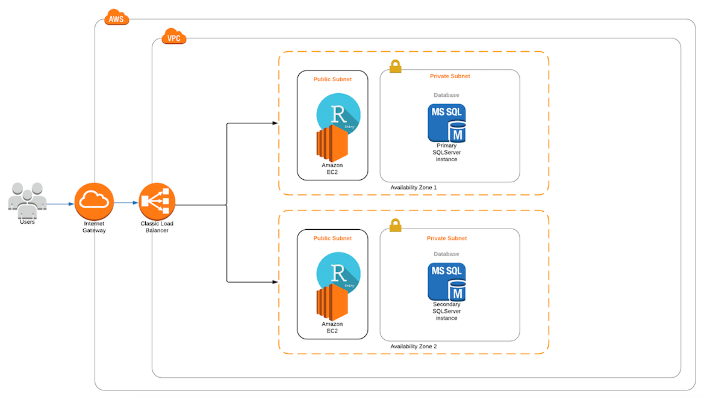

## Introduction

Software as a service (SAAS) is a business model that has become very familiar to most people. Many of the interactions we have with some of the most popular corporations is through a SAAS business model. Whether its for entertainment (Netflix/Hulu/AmazonPrime), socialization (Facebook/Twitter/Snapchat), financial management (Mint/Betterment), more and more firms are looking to deliver their products/services through a SAAS model.

All that being said, what is a SAAS? It's such a buzzword today, but do most regular folks really get what that means? To better understand the nature of this increasingly common arrangement, we seek to implement a small application that leverages some of the key technological components of a SAAS.

## Implementation Plans

### Infrastrucutre

While there are many cloud service providers, Amazon has by far the most services available on their platform. We will take advantage of just a few of those services in this implementation. The application itself will be hosted leveraging the Elastic Compute (EC2) service and the data the application uses to run will be held in a MySQL database on the Relational Database Service (RDS). In order to accomodate a large user load, we will use a load balancer to distribute incoming traffic across multiple instances of the described EC2/RDS infrastructure. Below is a diagram displaying the envisioned configuration.

### Data

Some comments about the GTD data.

### Application

Some comments about R/Shiny/Leaflet/mapping applications. 

## Results

### AWS Application Infrastructure

Some screenshots and comments about actually putting everything together. Including some more detailed commentary about the networking and security side of stuff.

### Data & Application

Some screenshots and commentary about the application.

## Further development

Ideas about further development like integrating authentication which would allow you to give different clients access to their own data because you know who is logged in. Some further ideas for app development.

